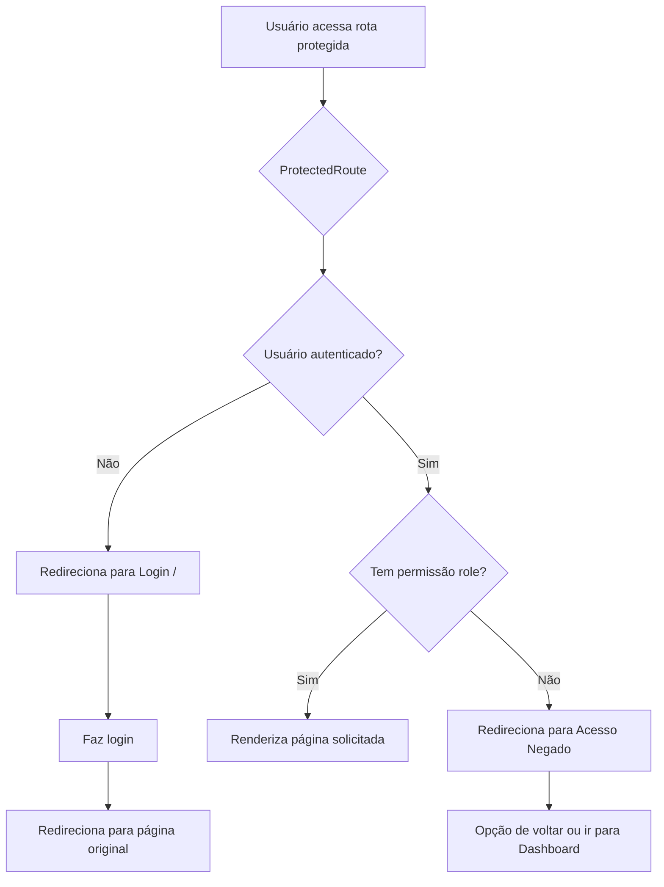

# Sistema de Controle de Acesso - SIGAJ

## Visão Geral

O SIGAJ (Sistema de Gestão de Aprovações Jurídicas) implementa um sistema robusto de controle de acesso baseado em **RBAC (Role-Based Access Control)** com quatro níveis hierárquicos de permissões.

## Arquitetura de Segurança

### Componentes Principais

1. **ProtectedRoute** (`src/components/ProtectedRoute.jsx`)
   - Componente de proteção de rotas
   - Verifica autenticação do usuário
   - Valida permissões baseadas em roles
   - Redireciona para login ou página de acesso negado conforme necessário

2. **Login** (`src/pages/Login.jsx`)
   - Página dedicada de autenticação
   - Interface amigável com informações do sistema
   - Redirecionamento inteligente após login

3. **AcessoNegado** (`src/pages/AcessoNegado.jsx`)
   - Página de erro 403 personalizada
   - Mostra informações do usuário e permissões atuais
   - Oferece navegação para páginas autorizadas

## Hierarquia de Roles

### 1. Diretor Jurídico (Nível mais alto)
- **Acesso completo** a todas as funcionalidades
- Pode criar novos pareceres
- Visualiza todos os pedidos e relatórios
- Gerencia usuários com permissões completas

**Permissões:**
- ✅ Dashboard
- ✅ Pedidos (todos)
- ✅ Novo Parecer
- ✅ Usuários (editar/criar/excluir)
- ✅ Relatórios
- ✅ Atividades

### 2. Vice-Diretor Jurídico
- **Acesso quase completo**, similar ao Diretor
- Pode criar novos pareceres
- Visualiza a maioria dos pedidos
- Gerencia usuários

**Permissões:**
- ✅ Dashboard
- ✅ Pedidos (maioria)
- ✅ Novo Parecer
- ✅ Usuários (editar/criar/excluir)
- ✅ Relatórios
- ✅ Atividades

### 3. Chefe de Divisão
- **Acesso gerencial** a sua área
- Visualiza pedidos atribuídos e do seu setor
- Pode aprovar/devolver pareceres
- Acesso a relatórios gerenciais

**Permissões:**
- ✅ Dashboard
- ✅ Pedidos (atribuídos e do setor)
- ❌ Novo Parecer
- ✅ Usuários (visualizar)
- ✅ Relatórios
- ✅ Atividades

### 4. Técnico (Nível mais baixo)
- **Acesso operacional** limitado
- Visualiza apenas pedidos atribuídos ou criados
- Pode executar tarefas atribuídas
- Sem acesso a relatórios gerenciais

**Permissões:**
- ✅ Dashboard
- ✅ Pedidos (apenas atribuídos/criados)
- ❌ Novo Parecer
- ✅ Usuários (visualizar)
- ❌ Relatórios
- ✅ Atividades

## Matriz de Acesso por Página

| Página | Diretor | Vice-Diretor | Chefe | Técnico |
|--------|---------|--------------|-------|---------|
| Dashboard | ✅ | ✅ | ✅ | ✅ |
| Pedidos | ✅ (todos) | ✅ (maioria) | ✅ (setor) | ✅ (atribuídos) |
| Novo Parecer | ✅ | ✅ | ❌ | ❌ |
| Usuários | ✅ (editar) | ✅ (editar) | ✅ (ver) | ✅ (ver) |
| Relatórios | ✅ | ✅ | ✅ | ❌ |
| Atividades | ✅ | ✅ | ✅ | ✅ |

## Fluxo de Autenticação



## Implementação Técnica

### Como Proteger uma Nova Rota

```jsx
// Em App.jsx
<Route
  path="/nova-funcionalidade"
  element={
    <ProtectedRoute
      allowedRoles={["Diretor Jurídico", "Vice-Diretor Jurídico"]}
    >
      <Layout currentPageName="NovaFuncionalidade">
        <NovaFuncionalidade />
      </Layout>
    </ProtectedRoute>
  }
/>
```

### Como Verificar Permissões em Componentes

```jsx
import { User } from "@/entities/User";

// No componente
const [user, setUser] = useState(null);

useEffect(() => {
  const loadUser = async () => {
    const currentUser = await User.me();
    setUser(currentUser);
  };
  loadUser();
}, []);

// Verificar role
const isManager = ["Diretor Jurídico", "Vice-Diretor Jurídico"].includes(user?.cargo);

// Renderização condicional
{isManager && (
  <Button>Ação Restrita</Button>
)}
```

## Segurança e Boas Práticas

### ✅ O Que Foi Implementado

1. **Proteção de rotas** - Todas as rotas estão protegidas com ProtectedRoute
2. **Verificação de roles** - Cada rota valida se o usuário tem a permissão necessária
3. **Redirecionamento inteligente** - Login e páginas de erro com UX adequada
4. **Separação de responsabilidades** - ProtectedRoute cuida da segurança, Layout da UI
5. **Feedback visual** - Usuário sempre sabe por que não pode acessar algo

### ⚠️ Limitações Atuais (Mock)

1. **Autenticação mock** - Sistema usa dados mock, sem backend real
2. **Sem JWT** - Não há tokens de autenticação
3. **Sem criptografia** - Dados não são criptografados
4. **Controle apenas frontend** - Sem validação server-side
5. **Sem sessão persistente** - Logout ao recarregar página

### 🔒 Recomendações para Produção

1. **Implementar autenticação real**
   - Integrar com backend (OAuth2, JWT, etc.)
   - Adicionar tokens de autenticação
   - Implementar refresh tokens

2. **Validação server-side**
   - Backend deve validar TODAS as permissões
   - Nunca confiar apenas no frontend
   - Implementar middleware de autorização na API

3. **Segurança adicional**
   - HTTPS obrigatório
   - CSRF protection
   - Content Security Policy
   - Rate limiting
   - Auditoria de acessos

4. **Gerenciamento de sessão**
   - Timeout de inatividade
   - Logout automático
   - Sessões persistentes (localStorage/cookies seguros)

5. **Logs e monitoramento**
   - Registrar todas as tentativas de acesso negado
   - Alertas para comportamentos suspeitos
   - Logs de auditoria para compliance

## Manutenção e Extensibilidade

### Adicionar Novo Role

1. Adicionar o role em `navigationItems` no `Layout.jsx`
2. Atualizar a matriz de permissões nas rotas do `App.jsx`
3. Atualizar a lógica de filtragem em `Pedidos.jsx` se necessário
4. Atualizar esta documentação

### Modificar Permissões

1. Editar o array `allowedRoles` no ProtectedRoute da rota desejada
2. Atualizar `navigationItems` no Layout.jsx
3. Testar com diferentes roles
4. Atualizar a matriz de acesso neste documento

## Testes Recomendados

### Teste Manual

1. **Login**: Testar login e redirecionamento
2. **Acesso direto por URL**: Tentar acessar rotas diretamente
3. **Mudança de role**: Simular diferentes roles e verificar acessos
4. **Logout**: Verificar se logout limpa sessão corretamente
5. **Página de erro**: Testar acesso negado com diferentes roles

### Teste Automatizado (Recomendado)

```javascript
describe('ProtectedRoute', () => {
  it('deve redirecionar para login se não autenticado', () => {
    // teste
  });

  it('deve redirecionar para acesso negado se não tem permissão', () => {
    // teste
  });

  it('deve renderizar página se autenticado e autorizado', () => {
    // teste
  });
});
```

## Suporte

Para dúvidas ou problemas relacionados ao controle de acesso:

1. Verificar esta documentação
2. Revisar os comentários nos componentes:
   - `src/components/ProtectedRoute.jsx`
   - `src/App.jsx`
   - `src/components/Layout.jsx`
3. Consultar a equipe de desenvolvimento

---

**Última atualização:** Outubro 2025
**Versão do sistema:** 1.0.0
**Status:** Mock Implementation - Não usar em produção sem implementar segurança real
